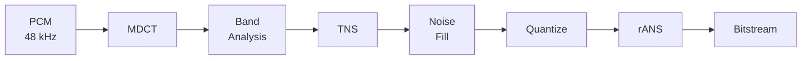
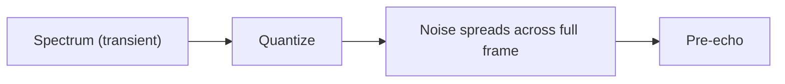
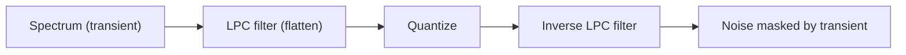

# HQLC codec design

## Why do I need another audio codec?

TLDR; I needed an audio codec that can provide me with good / transparent audio quality at 96-128kbps range, while being truly low complexity / easy to encode and decode on embedded microprocessors such as Espressif ESP32. I've evaluated a few audio codecs, but none really matched my needs.
- **Opus** - Excellent compression and efficiency, completely open and royalty free. Unfortunately, it's a bit complex for embedded targets. Both the encoder and decoder have large stack and flash footprints, and the encoding side in particular is quite CPU-heavy. Not a great fit for embedded targets like an ESP32.
- **LC3** - Marketed as low complexity and used in Bluetooth LE Audio. The spec itself is still fairly involved though - mixed-radix FFT, arithmetic coding, spectral shaping, and the publicly available implementations lack good fixed-point encoder/decoder paths, so on an ESP32 it ends up not being as fast as you'd expect. It also typically requires a license for use outside of Bluetooth, which limits where you can deploy it.
- **AAC-LC** - The core patents have technically expired, but the codec itself is showing its age. At comparable bitrates it provides lower quality than Opus or LC3, and the encoder/decoder still uses quite a bit of memory.
- **SBC** - Very low complexity and small footprint, but the compression efficiency is noticeably worse than any of the transform-based codecs above. Fine for Bluetooth Classic at higher bitrates, but not competitive at 96-128 kbps.

A note on the target bitrate: HQLC deliberately does not try to compete below 96 kbps. At lower bitrates, codecs like Opus switch to SILK, a voice optimized linear prediction that is fundamentally different from MDCT-based coding. Thats a completely different problem / domain, and HQLC is not made for usage there. Hence all the benchmarks & my measurements are at 96kbps+.

So, all the MDCT transform based codecs are quite heavy and complex. Subband codecs like SBC fill the gap for low complexity & low memory footprint compression, but they are a lot less efficient than transform based codecs. Hence why I decided to try to design one :) I'll try to describe how HQLC (and overall how transform codecs) work stage by stage, and the reasons why I chose a specific design over another one. Although, keep in mind that I'm not an audio engineer, and my understanding of the concepts might be flawed.

### Encoder pipeline overview

## MDCT, splitting PCM into frequency bins

The heart of all transform codecs. It takes raw PCM data, and converts it into values in frequency domain. Instead of coding individual samples, we describe the signal as frequency content. This is much more compressible and maps to how we actually hear audio.

MDCT processes overlapping blocks where each block shares half its samples with the previous and next one. This 50% overlap plus a window function gives you perfect reconstruction (transform then inverse-transform = exact original). You can implement the MDCT directly as a sum of cosines, but that's quite expensive. Therefore, the standard trick is to decompose it into a window, a time-domain fold, and a DCT-IV, which can then be computed via FFT in O(N log N). The window+fold produces 512 values from the 1024-sample block, and the DCT-IV turns those into 512 spectral coefficients.

The transform window is KBD, similar to what AAC does. KBD has better sidelobe rejection than a sine window, meaning less energy leaking between frequency bins. That matters for tonal signals like sustained notes, where you want each harmonic to stay cleanly in its own bin instead of smearing into neighbors. Other codecs often use custom windows to reduce the required overlap for even lower latency, but at 10ms-ish frames I've decided it's not worth it.

DCT-IV is implemented via a half-length complex FFT with pre/post twiddle factors, reducing it to a 256-point FFT.

HQLC uses 512-sample frames (1024-sample blocks with overlap), so ~10.67 ms at 48 kHz. The 256-point FFT is pure radix-4 (256 = 4^4, four stages).

The 512 fixed sample frame is chosen on purpose. It's low enough for low latency applications, but with resolution good enough for high quality audio. There's another reason why it's explicitly 512 though - using 512 samples makes it possible to use pure radix-4, with no need for mixed radix stages. For comparison, LC3 supports 480-sample frames (exact 10ms). Since the DCT-IV uses a half-length FFT, that's a 240-point FFT, and 240 = 2^4 * 3 * 5 requires mixed radix stages (radix-2, 3, 4, 5). That makes the implementation more complex, requiring more LUTs for optimizations, and being overall less cache friendly. With 256 = 4^4, every stage is the same radix-4 butterfly, the logic is branch free and easier to optimize.

See `misc/python/mdct.py` for code. The C version is fixed-point and mixes in a bunch of optimizations & careful block floating point management - might be a bit hard to read.

## Band structure and spectral analysis

After the MDCT, audio is nicely split into 512 evenly split coefficients. These coefficients are split into 20 groups / bands, with uneven widths to make the later coding and analysis easier. The defined widths roughly follow ERB, as the ear is more sensitive to lower frequencies (first few bands cover like 3-8 bins) and the higher bands cover up to 81 bins. This is based on 1990 Glasberg & Moore - some codecs use Bark scale, but ERB is generally newer and more accurate.

For each of those bands / groups, we calculate an exponent index. It's a 6-bit value that describes the energy in a given band on a log scale, around ~1.5 dB per step. The exponent drives the coarseness of the per-band quantization, making it so louder bands get compressed more than quieter ones, as they can tolerate it. The formula is roughly `round(2 * log2(mean_squared_energy)) + 43`, 43 being a bias, calculated empirically so the range covers the actual range used in typical audio, without clipping. The choice of 6-bit values comes from the balance between a fine step for the quantizer and the actual cost of coding those exponents. For the actual coding, the exponents are coded with a simple DPCM code - aka, each exponent is written as the delta from the previous exponent. Exponents for channels 1+ are coded as a difference from channel 0 - that's a stereo optimization, as the stereo channels are often correlated, saving on side info there.

This is a similar concept to scale factors in AAC or MP3, but a bit simpler. In AAC, scale factors control a separate per-band gain that's applied before a uniform quantizer. In HQLC, the exponent directly sets the quantizer step size per band, so there's no separate scaling pass. Because the step scales with signal energy, quantization noise ends up roughly proportional to the signal level in each band. That's already a basic form of perceptual noise shaping on its own, without needing an explicit masking model.

## TNS (Temporal Noise Shaping)

When the MDCT quantizes a frame containing a sharp transient (like a loud drum hit, a castanet click, etc), the quantization noise spreads across the entire frame. It's audible as a "smear" or echo just before the attack, called pre-echo. This is an inherent artifact of transform codecs, and is usually mitigated in a few different ways.

One of the ways to fight it is called block switching. The idea is straightforward: when a transient is detected, the codec switches to a shorter MDCT window. A shorter window covers less time, which naturally limits how far the pre-echo artifact can spread. This is what MP3 and other codecs do.

The downside is complexity. You need a state machine for switching between long and short windows, including the transition windows in between. The band layout also has to change, since the 20-band exponent structure only really works for 512-sample frames. All of this roughly doubles the amount of windowing and analysis code you have to carry around.

To keep things simple, HQLC uses something called TNS (temporal noise shaping). When a transient happens, the MDCT coefficients end up with a specific pattern to them. TNS finds a short filter that flattens this pattern before quantization. The encoder sends the filter parameters as side info (cheap, just a few bits), and the decoder applies the inverse filter to restore the original shape. The trick is that the quantization noise, which was spread evenly across the flattened spectrum, now follows the restored shape and ends up concentrated where the signal is loud. The noise hides behind the transient instead of smearing before it.

**Without TNS:**

**With TNS:**

The filter itself is small (up to order 4), and the coefficients are found by looking at how neighboring spectral bins correlate with each other. This is a standard implementation - autocorrelation of the spectrum, Levinson-Durbin to get reflection coefficients, and a lattice FIR/IIR filter pair for the encoder/decoder respectively. The coefficients are quantized to 4 bits each via LAR (Log Area Ratio) mapping, which is coarse but enough for this purpose. Total side info when TNS is active: 1 flag bit + 3 order bits + up to 16 coeffs bits.

TNS only processes the high-frequency part of the spectrum (above ~2 kHz). Low-frequency content like bass notes also has correlated spectral bins, but for a different reason (tonal harmonics, not transients). Filtering those just adds distortion without helping pre-echo.

The filter's activation is gated with a simple energy ratio test, comparing the energy of the current frame to the previous one. If the current frame isn't at least 2x louder, there's likely no transient and TNS is skipped. This avoids running the filter on sustained signals where it would do more harm than good.

TNS was originally developed by Herre at Fraunhofer in the mid-90s for MPEG-2 AAC. The main patent (Herre, US 5,781,888, filed 1996) expired in 2016. The underlying building blocks (Levinson-Durbin, lattice filters, LAR quantization) are all standard DSP techniques in public domain.

## Noise fill

Some bands end up with very little energy, near silence, and bits can be saved up by simply skipping it. At the decoder, the flagged bands are filled with pseudorandom noise at an appropriate amplitude, as simply filling it with silence is worse perceptually.

Two separate checks / tiers can trigger a band to be noise filled.

**Tier 1** catches bands that are both quiet and non-tonal. A band qualifies if its exponent index is very low (7 or below) and its crest factor is below 20 dB. The crest factor check (peak energy vs mean energy) prevents noise-filling bands that contain a quiet but distinct tone, like a soft harmonic, which would sound wrong if replaced with noise.

**Tier 2** is a bit more complex. It exploits the fact that a human ear cannot hear quieter frequencies, if they are next to a louder neighbour - aka perceptual masking. This extends to even bands with moderate energies, when a band next to it is way louder, so usually that band would not be noise filled by the tier 1 check. To find which band is masked, a two pass sweep is done. One forward (lower bands mask higher ones) and one backward (downwards masking). If a band's energy is under this calculated envelope, it can be qualified for noise fill at a higher exponent cap than tier 1.

The noise itself is generated with a simple LCG (linear congruential generator) seeded from the frame index and band index, so it's deterministic. The amplitude of that noise is derived from the step size on the decoder, making it possible to recreate it without explicitly transmitting it.

### Quick note about psychoacoustics

Tier 2 noise fill is the only place where HQLC utilizes the spectral masking envelope. Other codecs usually use it for more complex psychoacoustic modelling. I tried driving the quantizer step itself with different masking models, allocating less bits to more deeply masked bands, refining the more prominent ones - but with negligible success at 96kbps+. As mentioned earlier, the exponents themselves provide "self-masking" (aka, the quantization is coarser for bands that are loud), so part of this model is already naturally accounted for. I also wanted to avoid making too many decisions about the quantization based on the mask, as all of this breaks once the listener decides to apply an equalizer over the received signal - that's when the mechanics of cross-band masking break.

There's also a temporal masking phenomenon (a loud sound will render the ear less sensitive for a short amount of time) that I tried to plug into the bit reservoir mechanism, but ultimately decided against it. All in all, at the target bitrates of HQLC, we are quite comfortable with the bit budget.

## Quantization

The quantizer turns each spectral coefficient into an integer symbol that can be later efficiently coded. This is where* the codec essentially becomes lossy. The quantizer is driven with one knob, called step size - it says how coarse should the rounding be.

_*ok, technically the MDCT in the fixed-point impl naturally drops some precision from the audio signal, so the 'perfect' reconstruction is a bit misleading, but you get the idea._

The step size formula for a given band is: `step = 2^((exponent - 43) / 4) * BW[b] / gain`. Three things go into it:

- The **exponent** (per-band, from the analysis stage) sets the base step. Louder bands get bigger steps. The **43** magic value is related to the previously mentioned bias / offset, it needs to be reapplied so we work with actual signal energy derived values.
- The **band weight** `BW[b]` is a normalization for the number of bins in a given band. As mentioned earlier, the actual band layout is not even - higher bands have more bins, lower have less. With strictly uniform quantization, the lower bands would get heavily penalized, while HF bands would get plenty of bits. The weight is `log2(bin_count) / log2(max_bin_count)`. Log2 also carries a bit of a perceptual curve to itself (higher frequencies matter less).
- The **global gain** is a single 7-bit code per frame (8 codes per octave). This is the only knob the rate controller turns to hit the target bitrate. Higher gain, finer steps, more bits.
  - Note: Some codecs like AAC use per-band gain values, that is used to shape the quantization noise around the spectrum. HQLC uses a single global gain, kind of like LC3 does to keep things simple + other mechanisms already account for the noise distribution.

The quantizer in itself is a deadzone quantizer, meaning that the coefficients that fall below a certain threshold (0.65 * step) get rounded down to zero. A standard threshold would be a 0.5, but after tuning it a bit empirically, the 0.65 value is a good trade-off of a bit more distortion on small coefficients, which are not significant either way.

At the decoder, nonzero symbols are dequantized with a centroid offset of 0.15: `sign(q) * (|q| + 0.15) * step`. This offset controls where within the quantization bin we place the reconstructed value. A 0 would put it at the bin edge - too low. A 0.5 at the center - too high. The optimal value of 0.15 depends on the distribution of the source signal. MDCT coefficients tend to follow a Laplacian distribution (aka most values are small, with exponentially decaying tails), which is common for transform coded audio. For a Laplacian source, the MMSE-optimal (minimum mean squared error, aka the value that minimizes the average reconstruction error) centroid works out to around 0.15. This is a standard result in quantization theory and shows up in other codecs too.

I experimented with doing something a bit smarter there. There's a paper by Gary Sullivan (1996) that explores optimal quantizer design for Laplacian sources. I tried to utilize it for per-band centroid optimization, estimating the distribution per band and computing a more accurate offset. The improvement was negligible, the fixed 0.15 works well enough.

Some codecs use full RDO (rate-distortion optimization) in the quantizer. This means the encoder tries multiple quantizer configurations per band, measures the actual bit cost and distortion for each, and picks the combination that gives the best quality at a given rate. AAC encoders seem to do this, iterating over scale factors until they find a good allocation. RDO can squeeze out extra quality but it's expensive, as the quantizer needs to be run a few times. I decided against it after experimenting a bit with it, as the improvements were also negligible at my target bitrates.

## Entropy coding

After quantization, we have integer symbols that need to be packed into bits as efficiently as possible, ideally close to the theoretical minimum. The theoretical minimum comes from Shannon's theorem, and is called Shannon entropy.

### Rice coding

My first approach was Rice coding, which is also what HQLC still uses for side information (exponents, etc). Rice codes are worth explaining because they're a good intro to entropy coding overall.

Rice coding in itself is quite simple. To encode a non-negative value, you split it into two parts using a parameter k. The upper bits are coded in unary (that many 1s followed by a 0), and the lower k bits are written directly, as a value. For example, for k=2, the value 7 becomes: upper = 7 >> 2 = 1, coded as "10", lower = 7 & 3 = 3, coded as "11", giving "1011" (4 bits). The value 0 would be just "000". Small values get short codes, large values get longer ones. The k is picked based on the expected distribution, higher k for data with larger values on average, lower k for lower values.

There are many variations on this idea (Golomb-Rice, Exp-Golomb, etc) that tweak the unary/binary split in different ways, but the core concept is the same. It's used in many places (like FLAC for example), and in HQLC it works well for the exponent deltas and other side info where the distribution is simple and predictable. But for the quantized MDCT coefficients, the distribution varies significantly between bands and across different gain settings. Rice only has one knob (k), so it can't adapt well to these varying shapes. Tricks like sending the per-band K value made the side info significantly larger too.

It's quite fast though and does not require any large lookup tables / symbol codes like Huffman does.

### Moving to rANS

Theoretically, the next logical coding to try would be Huffman coding, as this is what MP3 and AAC use. Huffman works by assigning shorter bit patterns to more probable values and longer ones to rare values, built from a binary tree of symbol frequencies. It can model arbitrary distributions, which is a big step up from Rice. However, it has some downsides, like the fact that the codebooks need to be quite large, in particular when trying to tie them to multiple distributions. Its probability tables also force you to round the probabilities to a full integer, wasting up to one bit.

Some codecs (like LC3 does) for example, use Arithmetic Coding, but those are usually heavily patented, and more complex depending on the actual implementation.

There's a more modern, and interesting choice though, that has been quite popular in the recent years. The family of Asymmetric Numeral Systems / ANS by Jarek Duda reaches theoretical Shannon entropy limits quite closely, and is significantly easier to implement & less complex than arithmetic coders. It's public domain too ([unless you are Microsoft](https://patents.google.com/patent/US20200413106A1) trying to push a patent for "enhancements" of someone else's work).

There are many different applications / families of ANS, but the one I'm using is called rANS (range ANS).

rANS works by maintaining a single integer, called the state. The state encodes all the information about the symbols seen so far into one number.

Say you have 3 possible symbols, called A, B, C, with probabilities 50%, 25%, 25%. In rANS, you express these as integer frequencies that sum to a power of two. With M=1024 (which is what HQLC uses), that's freq=[512, 256, 256]. You also build a cumulative frequency table: cf=[0, 512, 768, 1024]. This divides the 0-1023 range into three slots: A gets 0-511, B gets 512-767, C gets 768-1023.

To encode a symbol, you take your current state and split it: `state = (state / freq[s]) * M + (state % freq[s]) + cf[s]`. This "folds" the symbol's identity into the state. To decode, you look at `state % M` to find which slot it falls in (that tells you the symbol), then reverse the math to recover the previous state.

When the state gets too large, you emit a byte (`state & 0xFF`) and shift down (`state >>= 8`). When decoding, if the state gets too small, you read a byte and shift up. This keeps the state in a fixed range (16-24 bits in HQLC).

That's basically it. One of the big advantages of using it, is also the fact that the cost can be accurately calculated without actually coding the data, making the rate controller probes in HQLC very cheap.

The implementation is just integer multiply, divide, and modulo per symbol.

### How rANS works in HQLC

Each quantized coefficient is coded as up to three parts: a magnitude symbol (0-14 literal, or 15 as an escape for larger values), an optional overflow for magnitudes >= 15 coded with Exp-Golomb, and a sign bit for nonzero values.

But to code it, we need probability tables. A very large distribution table trained on all bands and all coefficients would be unreasonably large, and overly generalized. After all, the distribution varies both between the bands, and between the different gain values. HQLC uses 32 pre-trained frequency tables, indexed with a formula of `alpha = K * BW[b] / gain`. This captures how lively / how active a given band is. The lower the alpha, the more likely zeros are. The tables were trained on a larger audio corpus, and each is a probability distribution of the 15 magnitude symbols at a given alpha range.

Bands next to each other are paired (so band 0 + band 1, 2+3, etc) and share the same tables. This is a workaround for the more narrow bands, and is a bit of an optimization. Band 0 is very narrow (3 bins) so it's hard to reliably model its distribution, hence why it's mixed with band 1.

The sign bit uses a fixed 50/50 split, since positive and negative coefficients are equally likely. Because the split is exactly half of the probability mass, the rANS encode/decode for signs reduces to shift and mask operations with no table lookup.

The side information (exponents, TNS parameters, noise fill masks) is coded separately using Rice codes and fixed-width fields, packed into a bitstream header. The rANS payload follows after byte alignment. This split keeps things simple to parse, as the decoder reads the header with a bitreader, then switches to rANS for the bulk coefficient data.

The most expensive (from esp32 perspective) theoretical part of rANS is the required division in the encoder (coming from the `state = (state / freq[s]) * M + (state % freq[s]) + cf[s]` formula). This is worked around by using a reciprocal table, turning the division into multiplication.

The total static table footprint for the entropy coder is about 3.3 KB: 1 KB for the 32x16 frequency tables, 2 KB for the precomputed reciprocals, and the rest for alpha bin edges and a log2 LUT used for cost estimation. Not bad for a near-optimal entropy coder.

## Rate control

The rate controller's job is to pick a global gain code per frame so the output bitrate stays close to the target. As mentioned earlier, gain is the only knob - higher gain gives more bits, lower gain gives less bits.

The target bit budget per frame is simply `bitrate * 512 / 48000`. At 96 kbps, that's about 1024 bits per frame.

### Searching for the right gain code

While it does not have to be _exact_, the rate controller should accurately be able to estimate the gain code at which the quantizer will be driven, before running the quantizer. If we had plenty of spare CPU cycles, we could just run the entire encoding logic, see the resulting bits, then reiterate doing a binary search. But we can't afford that. There are some rough tricks to estimate it. For example, back when the codec was still using rice codes, I've used a fast feed-forward model to roughly learn the rates on the go, but thanks to rANS it's possible to very cheaply calculate the exact bitcount.

To find the right gain, HQLC does two probes:

**Probe 1**: try the previous frame's gain code. Estimate the bit cost using the rANS cost tables (this is cheap, just summing up per-symbol costs without actually running the encoder). If the estimated cost is close enough to the target (within 2%), use it. Most frames hit this fast path since audio doesn't change drastically frame to frame.

**Probe 2**: if probe 1 is too far off, estimate a correction. The gain code is log-domain (8 codes per octave), and bits scale roughly proportionally with gain, so `delta = 8 * log2(target / probe1_bits)` gives a good guess. Probe at the corrected gain, and pick whichever of the two probes lands closer to the target.

This is deliberately simple. AAC encoders might do 10+ iterations per frame to optimize scale factors. HQLC does at most 2 probes, each of which is just a cost estimation pass (no actual encoding). The result is a gain code that's usually within a few percent of optimal, which is good enough. This also puts the computational complexity of the encoder at a similar level to the decoder.

### Bit reservoir

Not every frame needs to hit the target exactly. Some frames (silence, sustained tones) are cheap to encode, while others (transients, complex passages) are expensive. Hitting the target on every frame would waste bits on places where we don't really need them, while starving the harder frames. This is what the bit reservoir is for. It allows the more expensive frames to borrow bits from the simpler ones, temporarily breaking the budget. Over multiple samples, it smooths out into the target bitrate.

HQLC's reservoir is simple. It tracks the running surplus/deficit (`res_bits += target - actual` per frame), clamped to +/- 2x the per-frame budget. When computing the effective target for the next frame, half the reservoir balance is added. So if we saved 200 bits over the last few frames, the next frame gets a target that's 100 bits higher, allowing finer quantization.

Another part of the RC is a simple EMA (exponential moving average) of the gain code, with alpha = 1/16. This tracks the long-term average gain. The rate controller uses it to limit how fast the gain can drop after a transient. Without this, the RC would oscillate a lot, causing audible glitches. There's also a small check for whether a frame is mostly silent, which triggers a coast / reuse of the previous gain value, to prevent the quantizer noise blowing up on quiet frames.

## Patent status

To the best of my knowledge, every building block in HQLC is either public domain or based on long-expired patents:

- **MDCT / DCT-IV via FFT** - standard signal processing, public domain.
- **KBD window** - published by Kaiser and Bessel, no patent restrictions.
- **Band exponents / DPCM coding** - basic quantization and differential coding techniques, public domain.
- **TNS** - the original Fraunhofer patents from the mid-90s have expired. The underlying techniques (Levinson-Durbin, lattice filters, LAR quantization) are textbook DSP.
- **Noise fill / spectral masking** - standard psychoacoustic concepts, not patentable in themselves.
- **Deadzone quantization** - standard quantization theory, public domain.
- **Rice coding** - public domain.
- **rANS** - explicitly placed in the public domain by Jarek Duda.
- **Rate control / bit reservoir** - basic rate control strategies are not patentable; specific implementations in other codecs may be, but HQLC's approach is straightforward and original.

This codec is designed to be fully patent-free and royalty-free. That said, I'm not a lawyer - if you're shipping a product, do your own due diligence.
