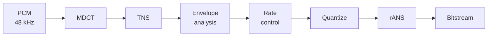

# HQLC codec design

## Why do I need another audio codec?

TLDR; I needed an audio codec that can provide good / transparent audio quality in the 96-128 kbps range, while being truly low complexity / easy to encode and decode on embedded microprocessors such as Espressif ESP32. I've evaluated a few audio codecs, but none really matched my needs.

- **Opus** - Excellent compression and efficiency, completely open and royalty free. Unfortunately, it's a bit complex for embedded targets. Both the encoder and decoder have large stack and flash footprints, and the encoding side in particular is quite CPU-heavy. Not a great fit for embedded targets like an ESP32.
- **LC3** - Marketed as low complexity and used in Bluetooth LE Audio. The spec itself is still fairly involved though - mixed-radix FFT, arithmetic coding, spectral shaping, and the publicly available implementations lack good fixed-point encoder/decoder paths, so on an ESP32 it ends up not being as fast as you'd expect. It also typically requires a license for use outside of Bluetooth, which limits where you can deploy it.
- **AAC-LC** - The core patents have technically expired, but the codec itself is showing its age. At comparable bitrates it provides lower quality than Opus or LC3, and the encoder/decoder still uses quite a bit of memory.
- **SBC** - Very low complexity and small footprint, but the compression efficiency is noticeably worse than any of the transform-based codecs above. Fine for Bluetooth Classic at higher bitrates, but not competitive at 96-128 kbps.

A note on the target bitrate: HQLC deliberately does not try to compete below 96 kbps. At lower bitrates, codecs like Opus switch to SILK, a voice-optimized linear prediction mode that is fundamentally different from MDCT-based coding. That's a completely different problem / domain, and HQLC is not made for usage there. Hence all the benchmarks & my measurements are at 96 kbps+.

So, the MDCT transform-based codecs are quite heavy and complex. Subband codecs like SBC fill the gap for low complexity & low memory footprint compression, but they are a lot less efficient than transform-based codecs. Hence why I decided to try to design one :) I'll try to describe how HQLC (and overall how transform codecs) work stage by stage, and the reasons why I chose a specific design over another one. Although, keep in mind that I'm not an audio engineer, and my understanding of the concepts might be flawed.

### Encoder pipeline overview


```mermaid
flowchart LR
    PCM["PCM\n48 kHz"] --> MDCT["MDCT"] --> TNS["TNS"] --> ENV["Envelope\nanalysis"] --> RC["Rate\ncontrol"] --> QUANT["Quantize\n"] --> RANS["rANS"] --> BIT["Bitstream"]
```

## MDCT, splitting PCM into frequency bins

The Modified Discrete Cosine Transform (MDCT) is the heart of most transform codecs. Raw PCM audio data is just a representation of the audio amplitude over time, which makes it hard to efficiently compress directly. MDCT takes a short chunk of that data, and splits it directly into values that represent the frequency content of the signal. This makes for a lot more structure than just raw PCM samples, and maps a lot more closely to how we actually hear audio.

MDCT processes overlapping blocks where each block shares half its samples with the previous and next one. This 50% overlap plus a window function gives you perfect reconstruction (transform then inverse-transform = exact original). You can implement the MDCT directly as a sum of cosines, but that's quite expensive. Therefore, the standard trick is to decompose it into a window, a time-domain fold, and a DCT-IV, which can then be computed via FFT in O(N log N). The window+fold produces 512 values from the 1024-sample block, and the DCT-IV turns those into 512 spectral coefficients.

The transform window is KBD, similar to what AAC does. KBD has better sidelobe rejection than a sine window, meaning less energy leaking between frequency bins. That matters for tonal signals like sustained notes, where you want each harmonic to stay cleanly in its own bin instead of smearing into neighbors. Other codecs often use custom windows to reduce the required overlap for even lower latency, but at 10ms-ish frames I've decided it's not worth it.

DCT-IV is implemented via a half-length complex FFT with pre/post twiddle factors, reducing it to a 256-point FFT.

HQLC uses 512-sample frames (1024-sample blocks with overlap), so ~10.67 ms at 48 kHz. The 256-point FFT is pure radix-4 (256 = 4^4, four stages).

The 512 fixed sample frame is chosen on purpose. It's low enough for low latency applications, but with resolution good enough for high quality audio. There's another reason why it's explicitly 512 though - using 512 samples makes it possible to use pure radix-4, with no need for mixed radix stages. For comparison, LC3 supports 480-sample frames (exact 10ms). Since the DCT-IV uses a half-length FFT, that's a 240-point FFT, and 240 = 2^4 * 3 * 5 requires mixed radix stages (radix-2, 3, 4, 5). That makes the implementation more complex, requiring more LUTs for optimizations, and being overall less cache friendly. With 256 = 4^4, every stage is the same radix-4 butterfly, the logic is branch free and easier to optimize.

See `misc/python/mdct.py` for code. The C version is fixed-point and mixes in a bunch of optimizations & careful block floating point management - might be a bit hard to read.

## Transient detection

This isn't a full-blown codec phase, but some of the later stages depend on whether the current frame is a 'transient' or not. A transient frame is one that contains a sudden change in the audio signal, such as a drum hit, castanet click, sudden sharp vocal.

Like Opus/CELT, HQLC detects attacks from the time-domain signal / PCM before the MDCT. A single audio frame is high passed with a simple first difference, split into 8 blocks of 64 samples each, and then each block's energy is measured against the average energy of the previous 8 blocks. If the difference is high enough, the frame is marked as transient.

This is quite similar to how Opus does it, just a bit simpler.

## Band structure and spectral analysis

After the MDCT, audio is nicely split into 512 evenly split coefficients. These coefficients are split into 20 groups / bands, with uneven widths to make the later coding and analysis easier. The defined widths roughly follow ERB, as the ear is more sensitive to lower frequencies (first few bands cover like 3-8 bins) and the highest band covers 67 bins. This is based on 1990 Glasberg & Moore - some codecs use Bark scale, but ERB is generally newer and more accurate. Only the first 427 bins (~20kHz) are coded, with the remaining bins being zero'ed.

For each of those bands / groups, we calculate an exponent index. It's a 6-bit value that describes the energy in a given band on a log scale, around ~1.5 dB per step. The exponent directly drives the coarseness of the quantization, making it so louder bands get compressed more than quieter ones, as they can tolerate it.

The exponents are calculated a bit differently depending on whether a frame is a transient frame or not. For transient frames, the exponent calculation is simply a geometric estimate of the energy in the band, using the mean squared energy and a logarithmic scale.

For non-transient frames, the encoder uses a finer analysis path. Instead of measuring only the 20 transmitted bands directly, it first measures energy on 47 fine bands. That fine estimate is lightly smoothed and then reduced back to the 20 transmitted exponents. The reduction is matched to the way the decoder later interpolates between exponent band centers, so the encoder is fitting the envelope shape that the quantizer will actually use.

The smoothing itself is pretty close to what LC3 does, and seems to improve the visqol / zim scores a bit - the coarse exponents can be a bit noisy across frames, so it helps stabilize the quantizer.

The exponents are adjusted with a bitrate-dependent static tilt. The tilt boosts the exponents of the higher bands, which makes their quantization coarser and effectively shifts bits down toward the perceptually more important lower/mid bands. It is strongest at 128 kbps and above (35 dB) and eases down to a 15 dB floor at lower bitrates. The stronger tilt at higher rates is deliberate: with more bits available, the high bands would otherwise attract more than they perceptually deserve, so the tilt reins them in harder. At lower rates the coarse global gain already starves the top end, so less explicit tilt is needed.

This is a similar concept to scale factors in AAC or MP3, but a bit simpler. HQLC does not apply any per-band scaling before the quantizer, so the exponents directly control the quantizer step size per band and the quantization noise roughly scales with the signal level in given bands, which gives a form of perceptual noise shaping without any explicit modeling.

## TNS (Temporal Noise Shaping)

When the MDCT quantizes a frame containing a sharp transient, like a loud drum hit or a castanet click, quantization noise can spread across the whole transform window. The most annoying form of this is noise that happens before the transient itself, called pre-echo. As it often happens in quiet sections before the signal, it can often be quite noticeable. It's a natural artifact of all MDCT-based codecs, and can be mitigated in a few different ways.

One way to fight this is block switching. When a transient is detected, the codec switches to a shorter frame. A shorter frame covers less time, which limits where the noise can spread. MP3, AAC, Opus/CELT, and many other transform codecs use this idea.

The downside is complexity. You need a state machine for switching between long and short windows, often including the transition windows in between. The band layout also has to change, since the 20-band exponent structure only really works for 512-sample frames. This can double the amount of windowing and analysis code quite a bit, so I've decided against using it.

To keep things simple, HQLC uses TNS instead. When a transient happens, the MDCT coefficients line up to a specific pattern. TNS's autocorrelation finds a short filter that flattens this pattern before quantization, "whitening" the noise. The encoder sends the filter parameters as side info, and the decoder applies the inverse filter to restore the original shape. This has a neat side effect of also shaping the quantization noise too, hiding it where the signal is loud.

The filter itself is intentionally tiny, order 0 to 4. The encoder computes autocorrelation on the spectrum, runs Levinson-Durbin to get reflection coefficients, clips them to a safe range, and quantizes them into 4 bits. The actual filtering is a lattice FIR in the encoder and the matching lattice IIR in the decoder.

TNS is only attempted on frames selected by the transient detector described above, with an extra 1 hangover frame. The hangover is done due to the overlap MDCT carries - the frame after an attack can still contain the attack in the left half of its window, even if it would not trigger the transient detector itself.

Only bins from 20+ are filtered, so around 940 Hz at 48 kHz. Filtering the low-frequency bins tends to distort bass and pitched content without helping pre-echo much, so HQLC leaves them alone.

TNS does not solve the pre-echo problem perfectly (and probably window-switching would be more-effective here), but it does reduce it by quite a bit.

TNS was originally developed by Herre at Fraunhofer in the mid-90s for MPEG-2 AAC. The main patent, Herre US 5,781,888, filed in 1996, expired in 2016. The underlying pieces used here - autocorrelation, Levinson-Durbin, reflection coefficients, LAR quantization, and lattice filters - are standard DSP tools.

## Quantization

The quantizer turns each spectral coefficient into an integer symbol that can be efficiently entropy coded later. This is where* the codec essentially becomes lossy. The quantizer is driven by a step size: a larger step means coarser rounding, fewer nonzero symbols, and fewer bits.

_\*ok, technically the MDCT in the fixed-point impl naturally drops some precision from the audio signal, so the 'perfect' reconstruction is a bit misleading, but you get the idea._

The step for a bin is derived from the transmitted exponent envelope and the global gain:

```text
step = 2^((2*exp - gain_code - 59) / 8)
```

The exponent is the local scale-factor-like value described earlier, while the global gain is a single 7-bit code per frame at 8 codes per octave. The gain is the only knob the rate controller turns: higher gain means finer steps and more bits, lower gain means coarser steps and fewer bits.

### Per-bin envelope interpolation

If the decoder used the 20 transmitted exponents directly, the quantization noise floor would jump at every band edge. That is especially noticeable on smooth tonal content. So on non-transient frames, both encoder and decoder linearly interpolate the exponent values between band centers to get a per-bin step size. This costs no side information, because the decoder can reconstruct the same interpolated envelope from the same 20 exponent values.

On TNS / transient frames, the steps stay flat per band. Attacks have genuinely sharp envelopes, so the exponent analysis path for those frames is the simple coarse-band estimate, no smoothing, no interpolation.

### Deadzone quantizer

HQLC makes use of a simple deadzone quantizer - coefficients below `0.65 * step` are rounded down to zero, and coefficients above that threshold become signed integer symbols:

```text
q = sign(x) * floor(|x| / step - 0.65 + 1)
```

At the decoder, nonzero symbols are reconstructed with a centroid offset of `0.15`:

```text
x_hat = sign(q) * (|q| + 0.15) * step
```

This offset controls where within the quantization bin we place the reconstructed value. A 0 would put it at the bin lower edge. 0.5 might seem like an obvious guess, but that assumes that the values are spread uniformly inside the bin. MDCT coefficients are not like that - most of them are small, and larger values get exponentially less likely as the magnitude grows. So within a quantization bin, the centroid offset should be closer to the bin lower edge. A value of around 0.15 works well for MDCT coefficients, and is a good fixed approximation of the optimal Laplacian-like distribution that MDCT follows.


### Noise fill

The deadzone quantizer intentionally turns small coefficients into zero. That's a good decision for our rate, but decoding long zero runs as literal digital silence tends to sound wrong. Our ears don't really like holes in the spectrum, between the tonal peaks. A standard approach is to fill the holes with noise, shaped to the right amplitude.

The tricky part is where we get this amplitude from. Most of AAC-ish codecs just transmit information about it, while Opus can infer the amplitude quite well due to how its quantizer (PVQ) works. Methods for noise-fill have been, and still are quite heavily patented, so in HQLC I've decided to do something a bit different.

The quantizer zeroes everything below the `0.65 * step` threshold. That threshold is known from the decoder side too, as thats how we dequantize. So a zero-bin implies that whatever was there, was below the that threshold. While that threshold itself cant be used as an amplitude estimate, the information of how many bins have been zero'ed in the entire band leaks a more-or-less layout of the band itself. After all, we know how many of the bins survived.

As the bins follow Laplacian distribution, we can exploit it to make a guess of how the rest of the band looked like. To model it, we need one parameter - the rough scale of the coefficients in the given band. This is being estimated from the zero count itself - if more bins have been zeroed, then most likely the smaller the coefficients have been. When tied into the distribution, we roughly estimate the level of the lost bins, and use that as the NF amplitude, without transmitting any side info. The noise itself is generated through a simple xorshift seeded per frame and channel.

The entire NF logic only triggers on bands where over 50% of the bins are zeroed. Below that, there's enough spectral content that the holes are not that noticable, and filling it with synthetic noise would likely just degrade it.

### Quick note about psychoacoustics

HQLC currently does not use an explicit spectral masking model. The perceptual shaping comes from a few simpler mechanisms. Exponents scale the quantizer step with local signal energy, the spectral tilt moves bits toward the more important lower/mid bands, TNS handles the temporal masking failure case around attacks, and noise fill repairs the texture of quantized-away noise floors.

Other codecs usually use stuff like spectral masking for more complex psychoacoustic modelling. I tried driving the quantizer step itself with different masking models, allocating less bits to more deeply masked bands, refining the more prominent ones - but with negligible success at 96kbps+. As mentioned earlier, the exponents themselves provide "self-masking" (aka, the quantization is coarser for bands that are loud), so part of this model is already naturally accounted for. I also wanted to avoid making too many decisions about the quantization based on the mask, as all of this breaks once the listener decides to apply an equalizer over the received signal - that's when the mechanics of cross-band masking break.

There's also a temporal masking phenomenon (a loud sound will render the ear less sensitive for a short amount of time) that I tried to plug into the bit reservoir mechanism, but ultimately decided against it. All in all, at the target bitrates of HQLC, we are quite comfortable with the bit budget.

Some codecs use full RDO (rate-distortion optimization) in the quantizer. This means the encoder tries multiple quantizer configurations per band, measures the actual bit cost and distortion for each, and picks the combination that gives the best quality at a given rate. AAC encoders seem to do this, iterating over scale factors until they find a good allocation. HQLC keeps the quantizer cheaper: the rate controller adjusts one global gain code, and the fixed exponent envelope handles the spectral shape.

## Entropy coding

After quantization, we have integer symbols that need to be packed into bits as efficiently as possible, ideally close to the theoretical minimum. The theoretical minimum comes from Shannon's theorem, and is called Shannon entropy.

### Rice coding

In HQLC, Rice coding is only used for side information, but its worth explaining first because it is a good intro to entropy coding overall.

Rice coding in itself is quite simple. To encode a non-negative value, you split it into two parts using a parameter k. The upper bits are coded in unary (that many 1s followed by a 0), and the lower k bits are written directly, as a value. For example, for k=2, the value 7 becomes: upper = 7 >> 2 = 1, coded as "10", lower = 7 & 3 = 3, coded as "11", giving "1011" (4 bits). The value 0 would be just "000". Small values get short codes, large values get longer ones. The k is picked based on the expected distribution, higher k for data with larger values on average, lower k for lower values.

There are many variations on this idea (Golomb-Rice, Exp-Golomb, etc) that tweak the unary/binary split in different ways, but the core concept is the same. It's used in many places (like FLAC for example), and in HQLC it works well for the exponent deltas and other side info where the distribution is simple and predictable. But for the quantized MDCT coefficients, the distribution varies significantly between bands and across different gain settings. Rice only has one knob (k), so it can't adapt well to these varying shapes. Adding enough per-band adaptation would also cost side information, which works against Rice's simplicity.

It's quite fast though and does not require any large lookup tables / symbol codes like Huffman does.

### using rANS for entropy coding

A classic solution is Huffman coding, which is what MP3 and AAC use. Huffman works by assigning shorter bit patterns to more probable values and longer ones to rare values, built from a binary tree of symbol frequencies. It can model arbitrary distributions, which is a big step up from Rice. However, it has some downsides, like the fact that the codebooks need to be quite large, in particular when trying to tie them to multiple distributions. Its probability tables also force you to round the probabilities to a full integer, wasting up to one bit.

Some codecs (like LC3 does) for example, use Arithmetic Coding, but those are usually heavily patented, and more complex depending on the actual implementation.

There's a more modern, and interesting choice though, that has been quite popular in the recent years. The family of Asymmetric Numeral Systems / ANS by Jarek Duda reaches theoretical Shannon entropy limits quite closely, and is significantly easier to implement & less complex than arithmetic coders. It's public domain too ([unless you are Microsoft](https://patents.google.com/patent/US20200413106A1) trying to push a patent for "enhancements" of someone else's work).

There are many different applications / families of ANS, but the one I'm using is called rANS (range ANS).

rANS works by maintaining a single integer, called the state. The state encodes all the information about the symbols seen so far into one number.

Say you have 3 possible symbols, called A, B, C, with probabilities 50%, 25%, 25%. In rANS, you express these as integer frequencies that sum to a power of two. With M=1024 (which is what HQLC uses), that's freq=[512, 256, 256]. You also build a cumulative frequency table: cf=[0, 512, 768, 1024]. This divides the 0-1023 range into three slots: A gets 0-511, B gets 512-767, C gets 768-1023.

To encode a symbol, you take your current state and split it: `state = (state / freq[s]) * M + (state % freq[s]) + cf[s]`. This "folds" the symbol's identity into the state. To decode, you look at `state % M` to find which slot it falls in (that tells you the symbol), then reverse the math to recover the previous state.

When the state gets too large, you emit a byte (`state & 0xFF`) and shift down (`state >>= 8`). When decoding, if the state gets too small, you read a byte and shift up. This keeps the state in a fixed range (16-24 bits in HQLC).

That's basically it. One of the big advantages of using it, is also the fact that the cost can be accurately calculated without actually coding the data, making the rate controller probes in HQLC very cheap.

The implementation is just integer multiply, divide, and modulo per symbol.

### How rANS works in HQLC

Each quantized coefficient is coded as a magnitude, an optional overflow, and an optional sign. Magnitudes `0..14` are direct rANS symbols. Magnitude `15` is an escape code - values above that code the remaining overflow with Exp-Golomb bits. The overflow bits and signs use a fixed 50/50 bit coder, which costs exactly one bit per bit and does not need a trained table.

The magnitude symbol uses one of 48 pre-trained rANS frequency tables. The table is selected from two context values that the decoder can reproduce without any extra side information:

- **Alpha** estimates the expected coefficient scale for the current band. It is derived from the global gain and a trained per-band-pair sigma value. Fine steps and naturally hot bands select tables with heavier tails, coarse steps and quiet bands select tables where zero is much more likely.
- **Activity** measures the fraction of nonzero coefficients in the previous band, quantized into four bins. Usually a dense previous band is a useful hint that the next band may also be dense.

Bands are paired for the alpha statistics (`0+1`, `2+3`, etc.) because the narrow low-frequency bands do not contain enough coefficients to model reliably on their own.

The side information (gain, TNS parameters, exponent deltas, and 3-bit noise factors) is coded separately with Rice codes and fixed-width fields in the frame header. The rANS payload follows after byte alignment. This split keeps parsing simple, the decoder just reads the header with a bitreader, then switches to rANS for the coefficient payload.

The most expensive part of rANS on a small CPU is the encoder-side division in the state update. HQLC avoids doing real division per symbol by using precomputed reciprocal tables, turning that step into multiplication and shifts.

## Rate control

The rate controller's job is to pick a global gain code per frame so the output bitrate stays close to the target. As mentioned earlier, gain is the only knob - higher gain gives more bits, lower gain gives less bits.

The target bit budget per frame is simply `bitrate * 512 / 48000`. At 96 kbps, that's about 1024 bits per frame.

### Searching for the right gain code

While it does not have to be _exact_, the rate controller should accurately be able to estimate the gain code at which the quantizer will be driven, before running the quantizer. If we had plenty of spare CPU cycles, we could just run the entire encoding logic, see the resulting bits, then reiterate doing a binary search. But we can't afford that. There are some rough tricks to estimate it. For example, back when the codec was still using rice codes, I've used a fast feed-forward model to roughly learn the rates on the go, but thanks to rANS it's possible to very cheaply calculate a more-or-less right bitcount without running the full encoding logic.

To find the right gain, HQLC does two probes:

**Probe 1**: try the previous frame's gain code. Estimate the bit cost using the rANS cost tables (this is cheap, just summing up per-symbol costs without actually running the encoder). If the estimated cost is close enough to the target (within 2%), use it. Most frames hit this fast path since audio doesn't change drastically frame to frame.

**Probe 2**: if probe 1 is too far off, estimate a correction. The gain code is log-domain (8 codes per octave), and bits scale roughly proportionally with gain, so `delta = 8 * log2(target / probe1_bits)` gives a good guess. Probe at the corrected gain, and pick whichever of the two probes lands closer to the target.

This is deliberately simple. AAC encoders might do 10+ iterations per frame to optimize scale factors. HQLC does at most 2 probes, each of which is just a cost estimation pass (no actual encoding). The result is a gain code that's usually within a few percent of optimal, which is good enough. This also puts the computational complexity of the encoder at a similar level to the decoder.

### Bit reservoir

Not every frame needs to hit the target exactly. Some frames (silence, sustained tones) are cheap to encode, while others (transients, complex passages) are expensive. Hitting the target on every frame would waste bits on places where we don't really need them, while starving the harder frames. This is what the bit reservoir is for. It allows the more expensive frames to borrow bits from the simpler ones, temporarily breaking the budget. Over multiple frames, it smooths out into the target bitrate.

HQLC's reservoir is simple. It tracks the running surplus/deficit (`res_bits += target - actual` per frame), clamped to +/- 2x the per-frame budget. When computing the effective target for the next frame, half the reservoir balance is added. So if we saved 200 bits over the last few frames, the next frame gets a target that's 100 bits higher, allowing finer quantization.

Another part of the RC is a simple EMA (exponential moving average) of the gain code, with alpha = 1/16. This tracks the long-term average gain. The rate controller uses it to limit how fast the gain can drop after a transient. Without this, the RC would oscillate a lot, causing audible glitches. There's also a small check for whether a frame is mostly silent, which triggers a coast / reuse of the previous gain value, to prevent the quantizer noise blowing up on quiet frames.

Transient frames get a 25% budget boost, which is later compensated on steady frames.

## Patent status

To the best of my knowledge, every building block in HQLC is either public domain or based on long-expired patents:

- **MDCT / DCT-IV via FFT** - standard signal processing, public domain.
- **KBD window** - published by Kaiser and Bessel, no patent restrictions.
- **Band exponents / DPCM coding** - basic quantization and differential coding techniques, public domain.
- **TNS** - the original Fraunhofer patents from the mid-90s have expired. The underlying techniques (Levinson-Durbin, lattice filters, LAR quantization) are textbook DSP.
- **Deadzone quantization** - standard quantization theory, public domain.
- **Rice coding** - public domain.
- **rANS** - explicitly placed in the public domain by Jarek Duda.
- **Rate control / bit reservoir** - basic rate control strategies are not patentable; specific implementations in other codecs may be, but HQLC's approach is straightforward and original.

This codec is designed to be fully patent-free and royalty-free. That said, I'm not a lawyer - if you're shipping a product, do your own due diligence.
